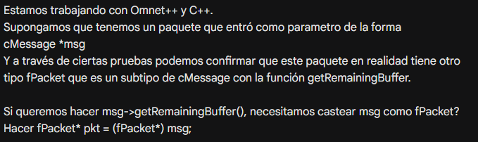
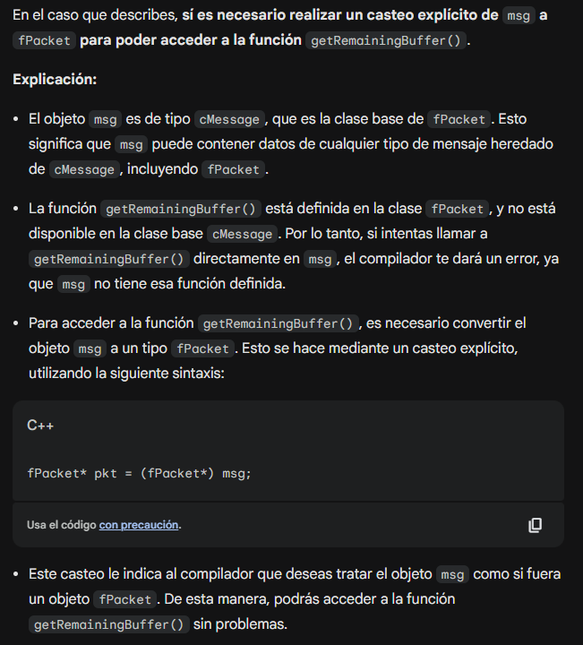
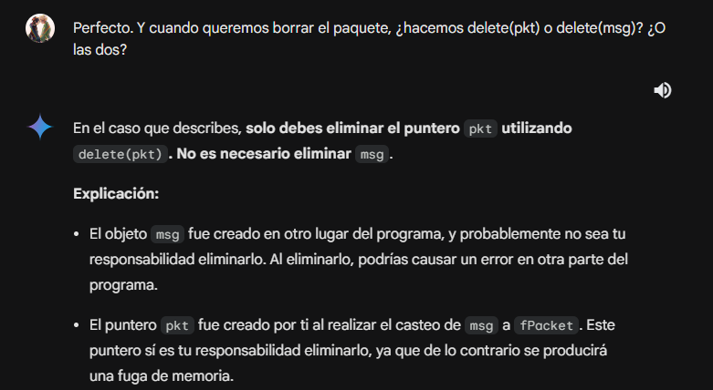

# Análisis de control de flujo y congestión en una network

## Redes y Sistemas Distribuidos

### Grupo 14. Integrantes: Javier Adragna, Guadalupe Galindo, Tomás Romanutti

### Profesores: Delfina Velez, Gonzalo Vodanovic

## Resumen

Se implementó un algoritmo para controlar el flujo y congestión en un modelo de colas simulado mediante _OMNet++_. Nuestra tarea fue analizar distintos casos de tráfico de red, modificando variables como las tasas de transferencia y el tamaño de los buffers, y analizando sus efectos en el rendimiento. Esto nos permitió identificar las problemáticas y proponer un protocolo que evita la pérdida de paquetes.

## Introducción

Un modelo de colas es una red donde los datos, representados como paquetes, son transmitidos desde un nodo emisor (`gen`) a un nodo receptor (`sink`), mediante una cola (`queue`) que los conecta. Tanto el emisor como el receptor están formados por dos partes: una queue personal y el propio generador o destino de datos. Cada conexión de estos elementos está limitada por una tasa de transferencia de datos, medida en Mbps, y el tamaño del buffer con el que cuenta cada cola. Si el buffer se llena, cualquier paquete entrante al mismo será descartado. Nuestro objetivo principal es evitar que esto suceda, mediante la implementación de nuestro propio diseño de control.

Dentro de nuestro modelo, hay dos buffers en particular que pueden generar estas pérdidas: el buffer del receptor y el buffer de la cola intermedia. Cuando el receptor es quien pierde datos, estamos hablando de un problema de **control de flujo**; mientras que cuando la cola intermediaria es la que pierde datos, entonces el problema pasa a ser de **control de congestión**. Ignoraremos el caso en el que el buffer del emisor se llene, ya que en la práctica la capacidad de este suele ser considerablemente mayor que la de los demás. Además, no buscamos frenar la velocidad con la que se generan los datos.
Para evaluar el comportamiento de la network ante los problemas ya mencionados, se ha uilizado el entorno de simulación de eventos discretos _OMNeT++_, el cual modela a la red de forma simplificada y nos permite analizar de forma controlada el comportamiento de la red y obtener diferentes métricas, haciendo más sencillo comparar el impacto de las diferentes mejoras.

-----------------------------------------------------------------------------------

En una primera instancia, se estudió el rendimiento de la network sin protocolo de control de saturación de buffers en dos casos diferentes. En cada uno de ellos se establecieron diferentes tasas de transferencia entre el nodo la cola intermedia (`queue`) y el receptor, y entre la cola interna de este y su salida hacia el destino.

En el caso 1, se fijó una tasa de transferencia entre la cola interna del nodo receptor y la salida hacia el destino menor a la tasa de transferencia de las conexiones que alimentan al nodo, lo que generó que recibiera paquetes a una velocidad mayor de la que la cola interna del mismo puede procesarlos, produciendo así la pérdida de paquetes (y un aumento en el dalay promedio de los paquetes que llegan a destino). Es decir, se generó un problema de _control de flujo_ y el factor limitante de la red fue buffer de la cola interna del nodo receptor.

#### Tasas de transferencia y delay

- Entre la cola del nodo emisor y la cola intermedia: `1Mbps`, `100us`
- Entre la cola intermedia y la cola del nodo receptor: `1Mbps`, `100us`
- Entre la cola del nodo receptor y el recolector: `0.5Mbps`

| Paquetes enviados | Paquetes recibidos | Paquetes perdidos | Delay promedio |
|-------------------|--------------------|-------------------|----------------|
| 1979              | 998                | 776 (39,3%)       | 32,87 (ms)     |

_Tamaño de los buffers durante el tiempo de simulación. Fuente: elaboración propia._

_Delay entre el envío y recepción de paquetes. Fuente: elaboración propia._

En este primer caso se puede observar cómo el buffer del nodo receptor se saturó de paquetes rápidamente, momento en el cual se comenzaron a perder paquetes debido a la política de descarte de la cola FIFO,  y se mantuvo en ese estado durante el resto de la simulación. El delay aumentó hasta llegar a un punto a partir del cual se mantuvo estable.

-----------------------------------------------------------------------------------

En el caso 2 se fijó una tasa de transferencia entre la cola intermedia y el nodo receptor menor a la tasa de transferencia entre el nodo generador y la cola intermedia, y entre la cola interna del nodo receptor y su salida hacia el destino, lo que generó que la cola intermedia recibiera paquetes a una velocidad mayor de la que la cola intermedia puede procesarlos. Es decir, se generó un problema de _control de congestión_, ya que en este caso la pérdida de paquetes se produjo en el buffer de la cola intermedia, la cual fue el factor limitante de la red en este estudio.

#### Tasas de transferencia y delay

- Entre la cola del nodo emisor y la cola intermedia: `1Mbps`, `100us`
- Entre la cola intermedia y la cola del nodo receptor: `0.5Mbps`, `100us`
- Entre la cola del nodo receptor y el recolector: `1Mbps`

| Paquetes enviados | Paquetes recibidos | Paquetes perdidos | Delay promedio |
|-------------------|--------------------|-------------------|----------------|
| 1979              | 998                | 776 (39,3%)       | 32,87 (ms)     |

_En ambos casos, la diferencia entre la cantidad de paquetes recibidos y la cantidad de paquetes perdidos no corresponde con la cantidad de paquetes enviados debido a que al finalizar la simulación los paquetes que no llegaron a destino (por estar almacenados en un buffer intermedio o por estarse transmitiendo en ese momento) no son contabilizados ni como paquetes dropeados ni como paquetes recibidos_

_Tamaño de los buffers durante el tiempo de simulación. Fuente: elaboración propia._

_Delay entre el envío y recepción de paquetes. Fuente: elaboración propia._

En este segundo caso se puede observar que el buffer que se saturó fue el de la cola intermedia. El delay entre el envío y la recepción de paquetes fue similar a la del primer caso de estudio.

La diferencia en la cola que se saturó en cada caso permite evidenciar de forma clara los casos de control de flujo y de congestión. Si bien ambos casos son similares y producen el mismo efecto en la red (aumento de delay y pérdida de paquetes), la problemática de cada uno reside en lugares distintos.

## Métodos

Una vez analizadas las problemáticas presentes en la red, para la construcción de nuestro diseño de control de flujo y congestión, se decidió implementar una versión simplificada del modelo de ventanas utilizado en TCP adaptado a las necesidades específicas de nuestro sistema.
Este enfoque simplificado se basa en una estructura de colas mejorada que permite la comunicación bilateral entre el emisor y el receptor. La implementación introdujo una variable denominada **remaining window**, que lleva la cuenta de cuántos paquetes puede enviar el emisor antes de solicitar información adicional al receptor. Cuando esta variable llega a cero, el emisor manda un paquete de control (**feedback packet**), para solicitar el espacio disponible en el buffer del receptor. Posteriormente, el emisor actualiza la variable `remaining window` con el valor proporcionado por el receptor en respuesta al paquete de control. Tener en cuenta que al principio de cualquier conexión `remaining window` se inicializa en cero y el emisor manda como primer paquete un `feedback packet`, ya que el emisor no conoce el tamaño del buffer del receptor.

_Diagrama de la red una vez aplicado el modelo de comunicación. Fuente: elaboración propia._

## Resultados

Se analizó el comportamiento de la red realizando una serie de experimentos usando simulaciones para evaluar el rendimiento del algoritmo de control implementado. Para ello se utilizaron los mismos casos de tasas de transferencia y delay que cuando se analizó a la network sin protocolo.

### Caso 1 - Control de flujo

| Paquetes enviados | Paquetes recibidos | Paquetes perdidos | Delay promedio |
|-------------------|--------------------|-------------------|----------------|
| 1942              | 997                | 0 (0%)            | 49,56 (ms)     |

_Tamaño de los buffers durante el tiempo de simulación. Fuente: elaboración propia._

_Delay entre el envío y recepción de paquetes. Fuente: elaboración propia._

En este primer caso, como se puede observar en los gráficos y a diferencia del estudio anterior de la red, el buffer del nodo receptor no se saturó cuando recibió paquetes a una velocidad superior a la que podía procesar su buffer interno.

### Caso 2 - Control de congestión

| Paquetes enviados | Paquetes recibidos | Paquetes perdidos | Delay promedio |
|-------------------|--------------------|-------------------|----------------|
| 1954              | 998                | 9 (0,46%)         | 50,22 (ms)     |

_En ambos casos, la diferencia entre la cantidad de paquetes recibidos y la cantidad de paquetes perdidos no corresponde con la cantidad de paquetes enviados debido a que al finalizar la simulación los paquetes que no llegaron a destino (por estar almacenados en un buffer intermedio o por estarse transmitiendo en ese momento) no son contabilizados ni como paquetes dropeados ni como paquetes recibidos_

_Tamaño de los buffers durante el tiempo de simulación. Fuente: elaboración propia._

_Delay entre el envío y recepción de paquetes. Fuente: elaboración propia._

En el segundo caso, la cola intermedia tampoco se saturó al recibir paquetes a una velocidad superior a la que su buffer podía procesar. Esto se debió a que, antes de alcanzar su capacidad máxima, entró en acción nuestro algoritmo, evitando que la cola pueda seguir recibiendo paquetes.

En ambos casos, gracias a la aplicación del protocolo de control, la pérdida de paquetes en la red fue prácticamente inexistente. Sin embargo, el costo a pagar por ello fue un aumento en el delay promedio de la entrega de los mismos y un aumento lineal del tamaño de la cola del nodo emisor, ya que el mismo debió guardar en su buffer los paquetes que todavía no podía enviar, mientras el generador continuaba produciendo paquetes nuevos.

-----------------------------------------------------------------------------------

_Demora de procesamiento por carga util. Fuente: elaboración propia._

El gráfico de retraso por carga ofrecida revela que nuestro diseño de control de flujo tiene un aumento significativo de la demora conforme la carga ofrecida aumenta, llegando a aumentar casi 20 ms en promedio debido al tiempo necesario para actualizar la ventana del emisor. Sin embargo, el hecho de que la pérdida de paquetes sea _prácticamente nula_ justifica el costo en términos de retraso de ejecutar nuestro algoritmo.

_Carga util por carga ofrecida. Fuente: elaboración propia._

Si observamos el gráfico de carga útil por carga ofrecida podemos concluir que la diferencia entre ambos modelos y casos es ínfima, siguiendo ambos la misma norma general. El caso de problema de congestión decae en cierto punto, pero la diferencia es cercana a nula (pasados 5 paquetes por milisegundo, los tres casos se mantienen entre 4,95 y 5).

Notar que el eje horizontal no está a escala, y el comportamiento de la carga útil en relación a la carga ofrecida es de manera lineal por debajo de 4.7 (es decir, carga útil = carga ofrecida).

## Conclusión

Los resultados obtenidos demuestran una mejora significativa en lo que respecta al control de flujo. Sin embargo, sería posible implementar mecanismos para hacer mas eficiente el control de congestión. Esto podría lograrse de manera similar a lo hecho con el `nodoRx` (receptor), pero recibiendo un feedback de la cola intermedia.

Si bien creemos que los algoritmos implementados están sujetos a futuras mejoras, estamos convencidos que este trabajo nos permitió entender y aplicar la teoría proporcionada por la cátedra de una mejor manera.

## Anexo: Utilización de herramientas de inteligencia artificial

A pesar de que la principal fuente de información ante las dudas propias del desarrollo del código fue la propia documentación de OMNeT++, en ocasiones puntuales y ante problemas específicos se consultó con el modelo de lenguaje _Gemini de Google AI_.

Desde un primer momento se tomó con mucha precaución cada respuesta proporcionada debido a la naturaleza propia del mismo. Esto tomó especial relevancia luego de que en una de las primeras interacciones recomendara incluir un header con caracteres del alfabeto árabe.

_Error de sugerencia del modelo de lenguaje Gemini. Fuente: elaboración propia._

El resto de las mismas estuvieron enfocadas en particularidades del funcionamiento de _C++_ y de _OMNeT++_, ambas herramientas con las que estábamos trabajando por primera vez. Todas ellas fueron validadas experimentalmente testeando en nuestro propio código, o bien buscando en fuentes alternativas que presentaron referencias verificables (como fue el caso de _StackOverflow_). A continuación se ejemplifican algunos de esos diálogos.

_Ejemplos de interacciones con el modelo de lenguaje Gemini. Fuente: elaboración propia._

## Video

Puede encontrar nuestro video explicando estos conceptos y demostrando cómo funciona el algoritmo en [este enlace](https://drive.google.com/file/d/1OB9x7g5fR0rTKxmYO0Tk-5qr3aVvfCBx/view?usp=drive_link)

## Bibliografía

- [Documentación de OMNeT++](https://doc.omnetpp.org/omnetpp/api/) version 6.0.3
- Contenido audiovisual [(videos y filminas)](https://famaf.aulavirtual.unc.edu.ar/course/view.php?id=300) provisto por la cátedra
- Tanembaum. Computer Networks: quinta edición - 2011.
